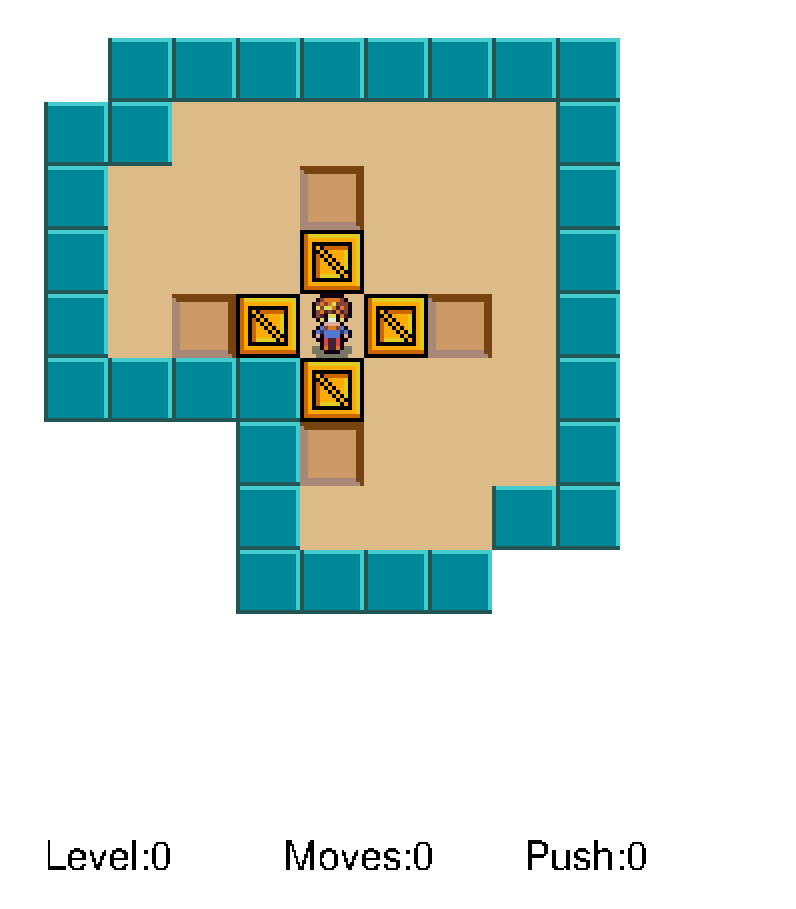

# PSSokoban
A Sokoban implementation in PostScript

</src>

#### Motivation

- implement [Sokoban](https://en.wikipedia.org/wiki/Sokoban) in PostScript
- play Sokoban in GhostView
- handle keystrokes immediately using unix pipes

See also:

- [PSChess](https://github.com/nst/PSChess)
- [Programming in PostScript](https://seriot.ch/projects/programming_in_postscript.html)

### Play Sokoban in Ghostscript

Terminal window 1:

    $ mkfifo /tmp/p; cat sokoban.ps /tmp/p | gs -

Terminal window 2:
    
    $ stty raw -echo; cat > /tmp/p

Play with arrows in window 2.

Cancel moves with `z` key.

### Notes and Limitations

Character icon from [OpenGameArt](https://opengameart.org/sites/default/files/characters_1.png)

Tested on macOS 15.
